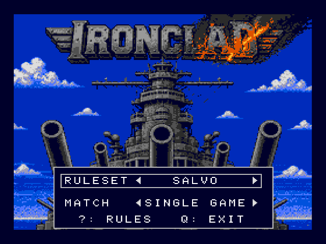
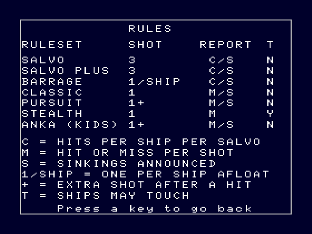
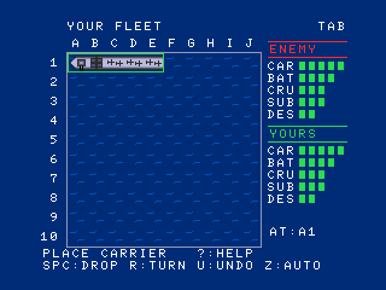
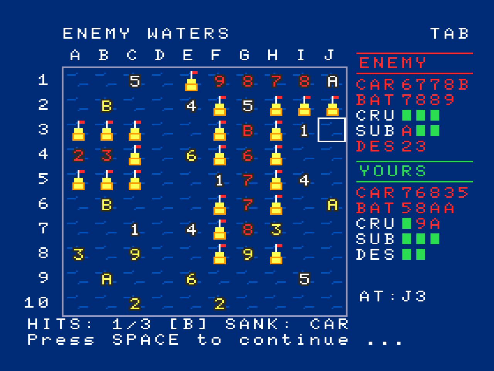
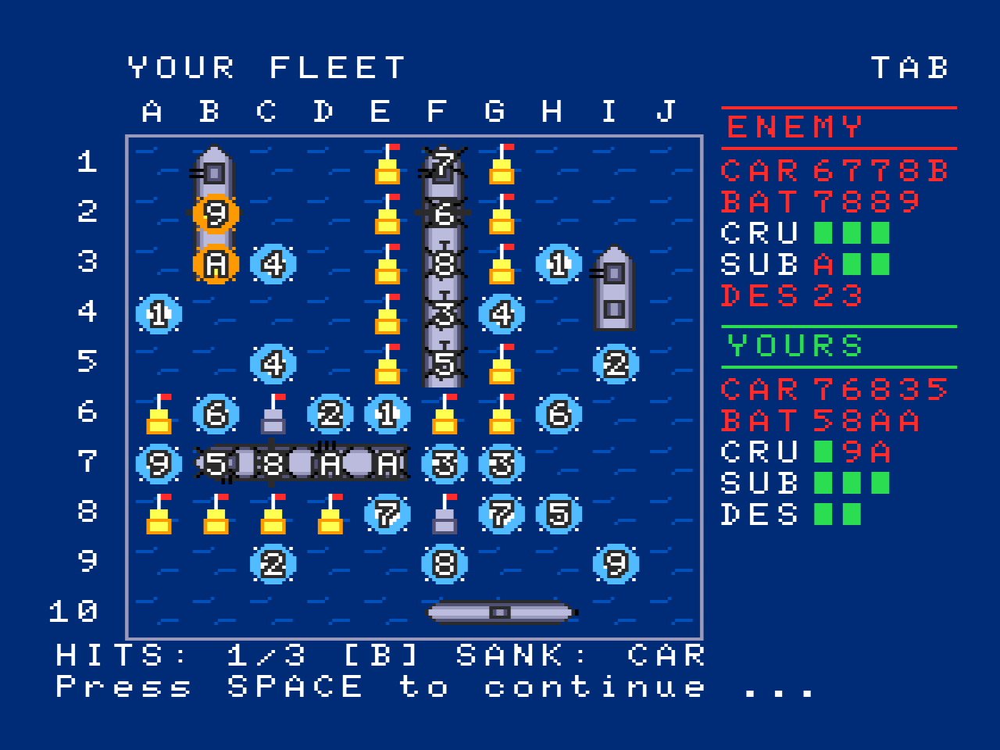
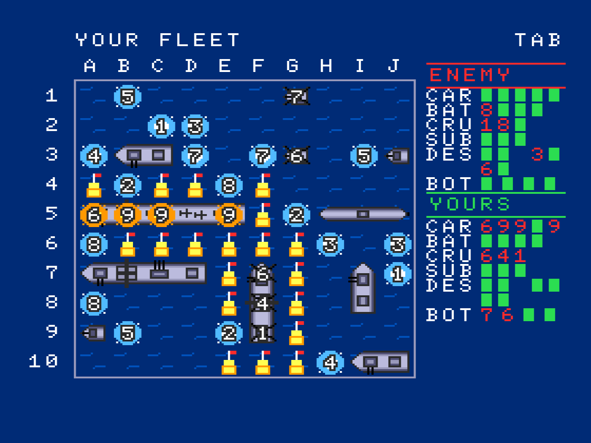
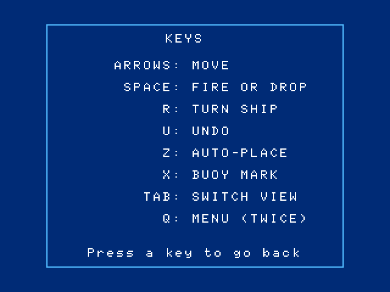
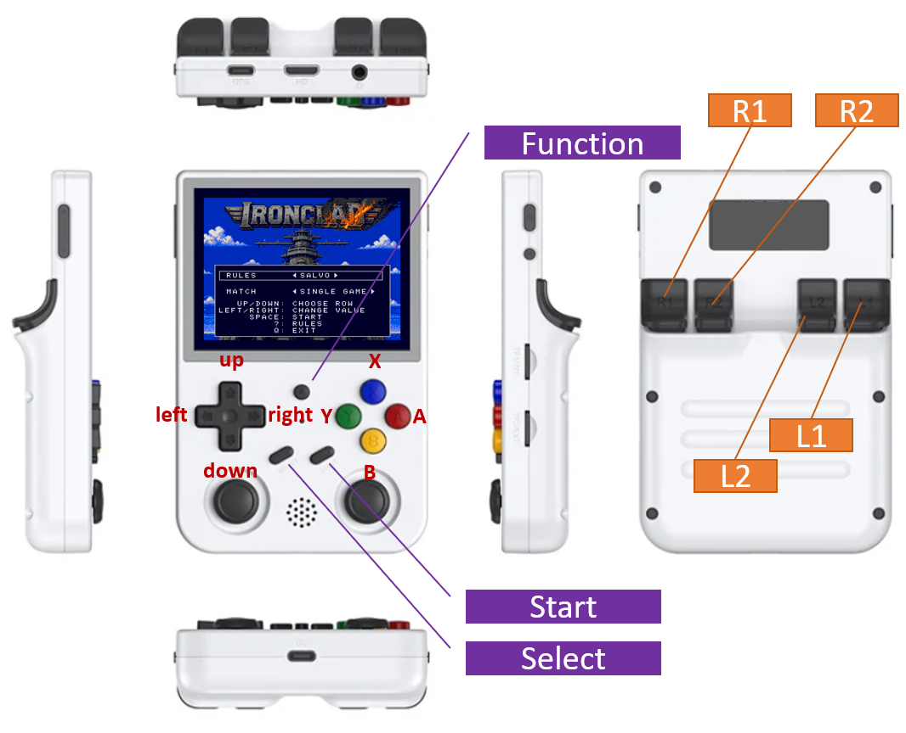
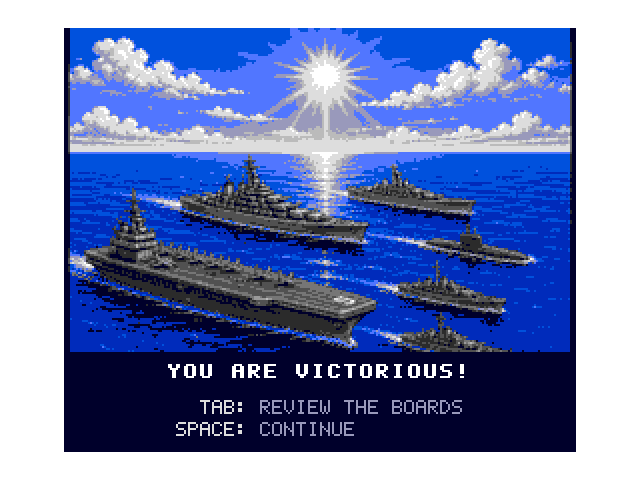
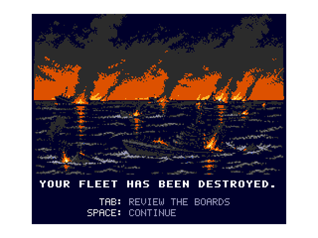

# IRONCLAD - Naval combat for the MSX2

*Beyond the unseen,*  
*victory or death.*

**[Download the game](https://github.com/mbelgin/ironclad/releases/latest)**
&nbsp;&middot;&nbsp;
**[the manual (PDF)](https://github.com/mbelgin/ironclad/raw/main/release/IRONCLAD_MANUAL.PDF)**

> **This game is in active development.** It will keep improving and changing,
> so expect the rulesets, the screens and the CPU algorithms to change
> between releases. Found a bug, or want something added? Please open an
> issue at
> [github.com/mbelgin/ironclad/issues](https://github.com/mbelgin/ironclad/issues).
> Bug reports and feature requests are both welcome.

Ten by ten squares of open sea, an enemy fleet matching your own hidden
somewhere on it, and no way to look across. Every shot you fire is a discovery,
and the distance between victory and defeat is what you make of them. Seven
rulesets, from a gentle kids' ruleset to salvo duels of pure deduction, with
best-of-N match play.

---

## Quick start

Boot the **IRONCLAD disk** (`IRONCLAD.DSK`) in any MSX2 emulator, or write
it to a 720 KB floppy for a real machine. The game loads and takes you to the
menu.

Loading takes a while, and there is more of it between games. On an emulator,
turn the speed or turbo control up to skip through it, then back down to play.

You need an **MSX2 with 128 KB of video RAM and a disk drive**. Any MSX2
capable emulator will do.

## The menu

Two rows. **RULESET** picks one of the seven ways to play; **MATCH** picks a
single game or a best-of-3, 5 or 7 series. Move between rows with ↑ ↓, change
a value with ← →, and press **SPACE** to start. **Q** twice exits to BASIC.

Press **?** at the menu for the rules of every ruleset side by side:

## Placing your fleet

You place your ships one at a time, largest first, on the YOUR FLEET grid. A
ghost of the current ship follows the cursor, **green** where it fits, **red**
where it doesn't.

Move it with the arrows, **R** **R**otates it, **SPACE** drops it, **U**
**U**ndoes the last deployed ship, and **Z** auto-places the rest. In every
ruleset except STEALTH, ships may not touch, not even diagonally, so each ship
needs a one-square ring of clear water. The same restriction binds the enemy.

When the last ship is down, a coin toss decides who fires first (in a match it
alternates from then on), and the battle begins.

## The battle

You fire on **ENEMY WATERS**: move the cursor, **SPACE** fires. The
enemy answers on **YOUR FLEET**, where its shots appear on your grid and its
results are reported on the message line. **TAB** flips between the two views
at any time, though you can only fire from ENEMY WATERS. The first side to hit
every square of every enemy ship wins.

What a shot tells you depends on the ruleset. In the single-shot rulesets each
shot is answered at once with hit, miss or sunk; in the salvo rulesets you fire
a whole salvo and are then told only how many hits landed on each ship, never
which shots landed them. [The rulesets](#the-rulesets) covers both.

The right-hand panels are the scoreboard, ENEMY above and YOURS below, one
entry per ship. **AT:** shows the coordinate under the cursor, and in a match
the score sits at the top (`GAME 2/3 1-0`).

**Buoys are your notepad.** Press **X** on a square of ENEMY WATERS to mark it:
an empty square cycles yellow buoy, gray buoy, clear, and a square you have
already fired at cycles its number red and back. Marks never affect play, and
you can still fire at a marked square. They earn their keep in the salvo
rulesets, where the board is the only place to keep your working. The enemy
keeps a notepad of its own: the buoys on YOUR FLEET are squares it has
*deduced* must be empty.

**?** puts the key list on screen at any point and any key dismisses it. **Q**
twice abandons the game and returns to the menu.

## The rulesets

| Ruleset | Shots per turn | Fleet | You are told | Ships touch |
|---|---|---|---|:---:|
| **SALVO** | 3, fired as a salvo | standard | hits per ship per salvo, sinkings named | no |
| **SALVO PLUS** | 3, fired as a salvo | extended | hits per ship per salvo, sinkings named | no |
| **BARRAGE** | one per ship afloat, as a salvo | standard | hits per ship per salvo, sinkings named | no |
| **CLASSIC** | 1 | standard | hit or miss per shot, sinkings named | no |
| **PURSUIT** | 1, +1 after every hit | light | hit or miss per shot, sinkings named | no |
| **STEALTH** | 1 | standard | hit or miss only | **yes** |
| **ANKA (KIDS)** | 1, +1 after every hit (you only) | big | hit or miss per shot, sinkings named | no |

Fleets, with the three-letter labels the panels use. **Standard, five ships**:
Carrier (CAR, 5), Battleship (BAT, 4), Cruiser (CRU, 3), Submarine (SUB, 3),
Destroyer (DES, 2). **Extended, eleven ships** (SALVO PLUS): the standard five,
then Destroyer (DES, 2) twice more and four single-square Boats (BOT, 1).
**Light, five ships** (PURSUIT): Frigate (FRI, 4), Corvette (COR, 3),
Cutter (CUT, 3), Launch (LAU, 2), Skiff (SKI, 2). **Big, six ships** (ANKA):
Carrier (CAR, 5) twice, Battleship (BAT, 4) twice, Cruiser (CRU, 3),
Submarine (SUB, 3).

### The salvo rulesets: SALVO, SALVO PLUS, BARRAGE

Both sides fire a complete salvo before any results are given, and the report
names only **how many hits landed on each ship, never which squares**.
Untangling that is the game.

Every shot is stamped with the number of the salvo it belonged to (1 to 9, then
A, B, C and on). Nothing else is ever drawn on the squares, so a sunk enemy ship
is named but never shown:

- a **white** number *(automatic)* means that salvo scored nothing: every square
  it hit is open water;
- a **yellow** number *(automatic)* means that salvo scored at least one hit,
  somewhere among its squares. Which of them, you have to work out;
- a **red** number *(yours, optional)* is one you marked yourself with **X**.
  Use it for a square you have *proved* holds a ship, so a hit you have pinned
  down stops looking like an open question.

Buoys carry the other half of the reasoning. Use of buoys is completely
optional, and the game attaches no meaning to either color: they are your
notepad. One recommended use:

- a **yellow buoy** for the ring around a ship you have found. No ship may
  touch another in these three rulesets, so the moment a ship's squares are
  known, every square surrounding it must be empty;
- a **gray buoy** for water you have ruled out: every ship still afloat is too
  long for the gap, so there is no point ever firing there.

Marked up this way the board carries your whole deduction, and whatever is left
unmarked is where the rest of the enemy fleet has to be.

*The red numbers are the player's own marks, on squares proved to hold a ship,
and the yellow buoys ring those hulls, which under SALVO rules must be clear
water. What is left unmarked is what remains to search.*

The ENEMY panel records, for each ship, the number of every salvo that hit it.
Above, `SUB A ▪ ▪` says salvo A struck the Submarine once and two of its squares
are still whole, while `CAR 6 7 7 8 B` is a Carrier hit on five separate salvos
and now sunk, which is why its name has turned red. A number appearing twice,
like the two 7s there, is a single salvo putting two shells into the same hull.
The YOURS panel mirrors all of it for the enemy's salvos against you.

While building a salvo, **U** takes back its last shot; once the final shot
fires the salvo resolves for good. After the enemy replies the game waits for
**SPACE**, leaving you time to study the board and mark buoys.

The enemy plays under the same report. It opens with spread shots over open
water, cross-references every salvo's hit counts against its own record of
where it fired, closes in when something is wounded, and writes off water no
surviving ship could occupy. The message line says what it is doing:
`ENEMY REVIEWS LAST SALVO ...`, then `ENEMY PROBES OPEN SEA ...` or
`ENEMY CLOSES IN ...`.

*The same moment from the other side. The numbers on a wreck are the salvos
that hit it, so the Carrier at F1 reading `7 6 8 3 5` is its panel row said
twice. The buoys here are the enemy's working, not yours: water it has proved
empty.*

**SALVO PLUS** sends the same three shells against a larger fleet of eleven
ships, four of them one square long. Hit a longer ship and you learn something:
it has to carry on into one of the squares beside the hit. A one-square Boat
sinks on the first hit and leaves nothing to reason from, so the last of them
have to be hunted square by square. **BARRAGE** gives you one shell for every
ship you still have afloat: five ships fire five shots, one ship fires one, so
your firepower shrinks as your fleet does, and so does the enemy's.

*`BOT 7 6 ▪ ▪`: two of your Boats gone, one hit each, on salvos 7 and 6. A
Boat's row can never hold more than one number.*

### The single-shot rulesets: CLASSIC, PURSUIT

One aimed shot per turn, answered immediately with hit, miss or sunk. A miss
shows as a splash, a hit as fire, and when a ship goes down it is revealed and
the water around the wreck is marked off for both sides, since no other ship
can be touching it. **PURSUIT** plays the same but with a lighter, faster fleet,
and every hit earns another shot at once, for you and the enemy alike.

### STEALTH

Ships may touch here, and you are told hit or miss and nothing else. Sinkings
are never announced, so the ENEMY panel shows every ship untouched from the
first shot to the last, and a row of hits could be one long ship or three short
ones end to end. The enemy is told just as little.

### ANKA (KIDS)

For young captains: the fleet is big ships only and is placed for you, every
hit earns the young side another shot (the computer gets no such favor), and
the enemy fires at random until it hits something, then works outward from the
hit. Meant to be beaten, though it does not miss on purpose.

## The opponent

**The computer never cheats.** In every ruleset it plays the strongest game it
knows, it sees no more of your fleet than you see of its own, and it is told
exactly what that ruleset's rules allow and never a square more. Every deduction
it makes is one you could have made from the same reports. What makes it
dangerous is bookkeeping: in the salvo rulesets it keeps a list of every
position each of your ships could still be in, crosses off the ones your reports
have ruled out, and picks its next target with algorithms as sophisticated as an
MSX2 allows.

## Controls

### On a keyboard

| Key | Menu | Placement | Battle |
|-----|------|-----------|--------|
| ↑ ↓ ← → | choose row / change value | move ship | move cursor |
| **SPACE** / RETURN | start | drop ship | fire / continue |
| **R** | | rotate ship | |
| **U** | | pick up last ship | take back last shot of the salvo |
| **Z** | | auto-place the rest | |
| **X** | | | buoy on empty water: yellow → gray → off; on a fired square: number red → back |
| **TAB** | | switch view | switch view |
| **?** | rules of every ruleset | key list | key list |
| **Q** | exit to BASIC (twice) | back to menu | terminate game (twice) |

Letters work in either case. Press **?** at any point in a game and the same
list appears on screen:

### On a handheld

IRONCLAD plays well on an emulator handheld, but it needs a keyboard's worth of
keys, so the buttons have to be mapped before the first game. These steps are
for **blueMSX**, the MSX core in RetroArch:

1. Start the game.
2. Press the **Function** key (the diagram below shows where it hides).
3. From the menu, choose **Controls**.
4. Choose a controls port, for example **Port 1 Controls**.
5. **Important:** set Device Type to **RetroKeyboard**. Without this the
   mapping below has nothing to map to.
6. Optional: set Analog to Digital Type to **Left Analog**.

*L and R sit on the back, out of view.*

Recommended bindings, tested on blueMSX only:

| Button | Key | Function |
|---|---|---|
| D-pad | ↑ ↓ ← → | move the cursor or the ship |
| **Y** (left) | SPACE | fire, and drop a ship while deploying |
| **A** (right) | U | undo: take back a shot or pick a ship back up |
| **B** (bottom) | R | rotate the ship being placed |
| **X** (top) | X | buoys, and the red marks on fired squares |
| **L1** | TAB | switch between the two boards |
| **R1** | Z | auto-place the rest of the fleet |
| **Select** | ? | the key list, and the rules table in the menu |
| **Start** | Q | back to the menu, or quit the game (press twice) |

When the mapping suits you, save it with **Save Game Remap File** in the
Controls menu, so a firmware update cannot take it away.

## End of game

**Match play.** MATCH offers a single game, or a series: best of 3, 5 or 7. A
series ends the moment one side takes the majority.

When the last ship goes down, the enemy's fleet is revealed and **TAB** looks
over both boards. In a series, **SPACE** starts the next game.

The verdict screen is kept for the end: a single game, or the game that settles
the series. It marks the war rather than each battle. There **TAB** cycles the
verdict and the two boards for a post-game analysis, and **SPACE** returns to
the menu.

---

IRONCLAD is free and always will be. If it made you happy, you can
[buy me a coffee](https://ko-fi.com/mbelgin): that's the QR code on the loading
screen.

IRONCLAD and its rulesets take after the pen and paper naval battle games
played on squared paper for generations. Any resemblance to trademarked products
is coincidental. MSX is a trademark of MSX Licensing Corporation.
